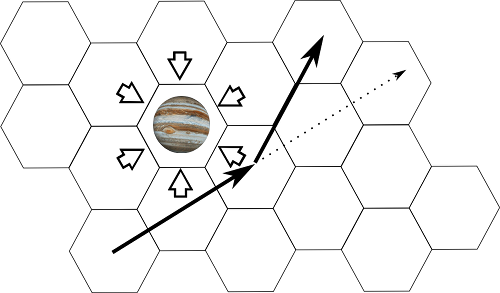

Interplanetary
==============

 

This is a full space combat board game that I created and which I 
have been gradually refining over many years of playing with my friends. 
The gameplay is fast and easy to learn yet portrays "realistic" space combat using
believable space ships on the Inner solar system scale. 

Interplanetary sports what is probably one of the most fluid Newtonian 
movement systems you can portray on a hex-grid in 2D, and it's really
quite easy to learn. For this reason it could probably work quite well 
also as an educational tool for kids learning about space and gravity. 

The combat mechanics are simple and model believable weapon systems. 
Each turn represents days of real time as ships move along their trajectories, 
missiles home in over vast distances and guns try to track that impossibly
small spot in the sky. 

Interplanetary is played by drawing directly on the printed map, making it 
very portable. The game comes with a manual but the game-aid contains everything 
needed for play, including customizing your ship with weapons, boosters and various 
bonus systems.

## Contents

The repository contains binary versions of the manual, the game-aid and
the map. The map and game-aids are supposed to be printed as each player and ship in the game gets
one game-aid. The map is best printed as large as possible, it has A4 proportions 
but can be printed to at least A3 without any problems. The only other thing needed is a six-sided die. 

Source files for creating everything is in src/. To compile the manual you need LaTeX whereas the gameaid is 
created in Inkscape and the map using GIMP. 

## Credits

The movement system of Interplanetary is borrowed from the long out-of-print game
[Triplanetary](http://www.sjgames.com/triplan/) by GDW. These days the license 
belongs to Steve Jackson Games. Apart from the concept of movement, Interplanetary
uses no other resources from Triplanetary.
